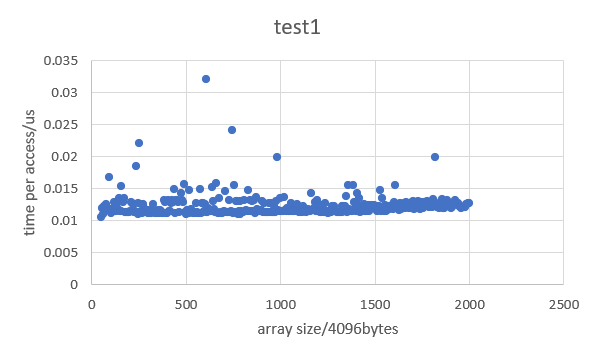
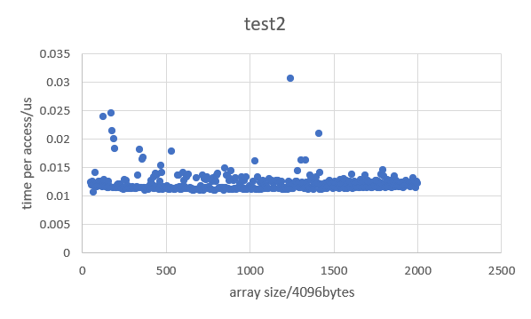
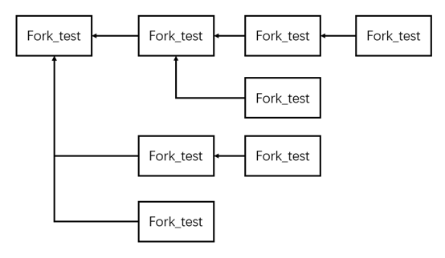

# Assignment 2

1. It may cause the thread to run multiple times, the problem is that right after the line `unlock mutex.spinlock` is executed, the thread is still in the runnable threads list, thus it may run again and makes other threads starved.

2. The problem is that the to line may get different status. Suppose there is x seats remaining and y cash on hand, right after the first line is executed someone buys a ticket, and then the second line is executed, the result is that the number of seats remaining is still x, but the cash on hand is (y-ticket price), which result in wrong account.

3. see problem3/Test.java

4. see problem4/BoundedBuffer_modified.java. The modified bounded works only when the number of objects sent is multiples of capacity, in other cases, there will by objects unretrieved in the bounded buffer.

5. a. Two-phase locking: impossible. Using two-phase locking, T1 will hold the exclusive locks of both x and y before modify them, and release locks after modifying both x and y, so there is no chance for T2 to see old value of x but new value of y.

   b. read-committed with short read lock: possible. In this isolation level, T2 releases the lock immediately after it reads the value of x, so it is possible for T1 to finish its commit before T2 read the value of y.

   c. snapshot isolation: impossible. In snapshot isolation, when T2 starts, if T1 is not committed, T2 cannot see new values of x or y during its transaction; if T1 is committed, T2 can only see new values of both x and y. 

6. virtual address: <code>0x6000(24567)</code>  <code>0x6FFC(28668)</code>

   Mapped physical address: <code>0x3000(12288)</code>  <code>0x3FFC(16380)</code>

7. the two pages belong to the last page table in the page directory. The page directory has 1024 items and each item point to a page table containing 1024 pages, so the index of first page of last page table in the page directory is 1023*1024=1047552, and the next one is 1047553

8. I wrote a c++ program for this problem, the program accepts an array size in 4096 bytes as argument and the outer loop times is 100. I also wrote a script to test the program with varying array size and store the result in a txt file. I tested the program on array size from 204800 bytes to 8192000 bytes and found that most of the time per array access are about 0.012us, there are some array sizes that the access time reaches 0.03us, but in the second test the same array size didn’t give a similar time, but dropped down to around 0.01us, so I assume they are just invalid data caused by system.

   hardware：

   CPU：i5-8300H

   Mem: 8GB 2667MHz

   software:

   OS: Linux 5.8.0-44-generic

   gcc version 9.3.0

 

9. there are 8 processes running the program.

